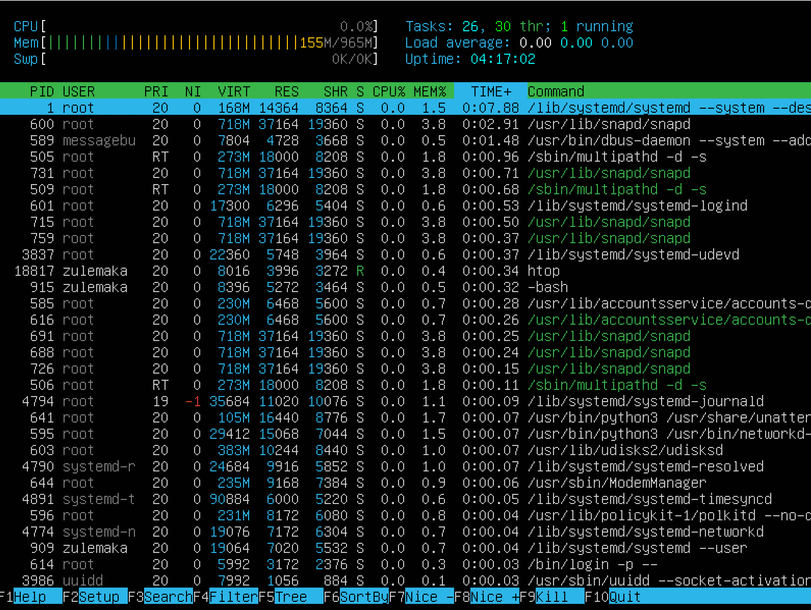
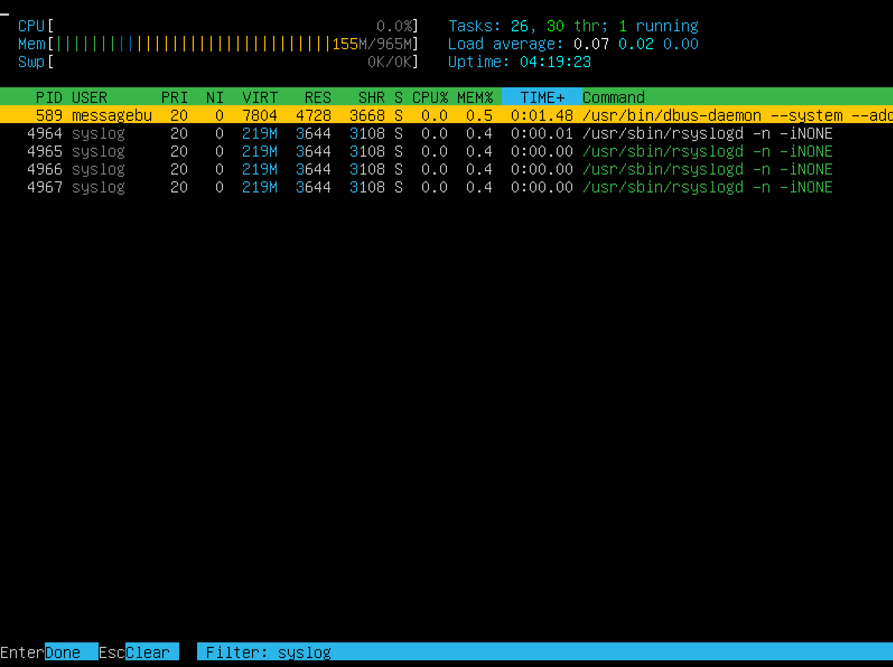
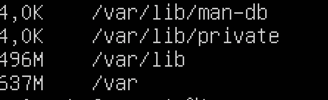
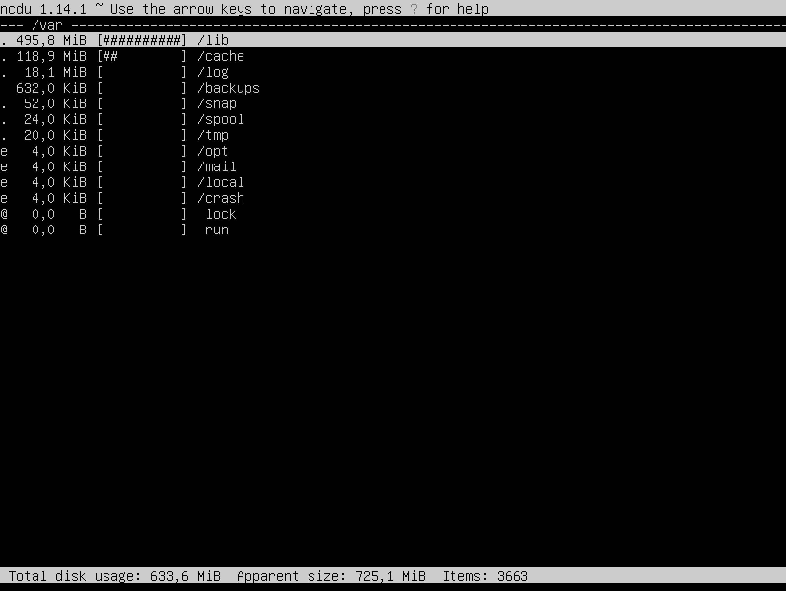

<h1>Linux</h1>
<h2>Part 1. Установка ОС</h2>
<ol>
  <li>Результат команды cat /etc/issue.</li>
  </h1>
</ol>
<h2>Part 2. Создание пользователя</h2>
<ol>
  <li>Создание пользователя</li>
  </h1>
  <li>Вывод команды cat /etc/passwd</li>
  </h1>
</ol>
<h2>Part 3. Настройка сети ОС</h2>
<ol>
  <li>Задать название машины вида user-1</li>
  </h1>
  <li>Установить временную зону, соответствующую вашему текущему местоположению.</li>
  </h1>
  <li>Вывести названия сетевых интерфейсов с помощью консольной команды.</li>
    </h1>
  <li>lo (loopback device) – виртуальный интерфейс, присутствующий по умолчанию в любом Linux. Он используется для отладки сетевых программ и запуска серверных приложений на локальной машине. С этим интерфейсом всегда связан адрес 127.0.0.1. У него есть dns-имя – localhost. Посмотреть привязку можно в файле /etc/hosts.</li>
    </h1>
  <li>Используя консольную команду получить ip адрес устройства, на котором вы работаете, от DHCP сервера.</li>
    </h1>
  <li>Протокол динамической конфигурации узлов (Dynamic Host Configuration Protocol, DHCP) — это сетевой протокол, используемый для автоматического получения узлами IP-адресов и сетевой конфигурации с сервера.</li>
  <li>Определить и вывести на экран внешний ip-адрес шлюза (ip) и внутренний IP-адрес шлюза, он же ip-адрес по умолчанию (gw).</li>
  </h1>
  <li>Задать статичные (заданные вручную, а не полученные от DHCP сервера) настройки ip, gw, dns (использовать публичный DNS серверы, например 1.1.1.1 или 8.8.8.8).</li>
  </h1>
  <li>Перезагрузить виртуальную машину. Убедиться, что статичные сетевые настройки (ip, gw, dns) соответствуют заданным в предыдущем пункте.</li>
    </h1>
  <li>Успешно пропинговать удаленные хосты 1.1.1.1 и ya.ru и вставить в отчёт скрин с выводом команды. В выводе команды должна быть фраза "0% packet loss".</li>
    </h1>
</ol>
<h2>Part 4. Обновление ОС</h2>
<ol>
  <li>Обновить системные пакеты до последней на момент выполнения задания версии.</li>
    </h1>
</ol>
<h2>Part 5. Использование команды sudo</h2>
<ol>
  <li>Разрешить пользователю, созданному в Part 2, выполнять команду sudo.</li>
  <li>Команда sudo ( substitute user and do, подменить пользователя и выполнить ) позволяет строго определенным пользователям выполнять указанные программы с административными привилегиями без ввода пароля суперпользователя root.</li>
      </h1>
      </h1>
</ol>
<h2>Part 6. Установка и настройка службы времени</h2>
<ol>
  <li>Настроить службу автоматической синхронизации времени.</li>
  </h1>
  </h1>
  </h1>
</ol>
<h2>Part 7. Установка и использование текстовых редакторов</h2>
<ol>
  <li>Используя каждый из трех выбранных редакторов, создайте файл test_X.txt, где X -- название редактора, в котором создан файл. Напишите в нём свой никнейм, закройте файл с сохранением изменений.</li>
  <li>Вим - создал Фаил через vim test_vim.txt внутри нажал esc + i чтобы начать писать esc  : + x чтобы сохранить и выйти</li>
  <li>Нано создал nano test_nano.txt написал и вышел через ctrl + x назад y для сохранения enter</li>
  <li>Джо создал joe test_joe.txt написал вышел через ctrl + K + X</li>
  </h1>
  </h1>
  </h1>
  <li>Используя каждый из трех выбранных редакторов, откройте файл на редактирование, отредактируйте файл, заменив никнейм на строку "21 School 21", закройте файл без сохранения изменений.</li>
  <li>Вим - Открыл через vim test_vim.txt нажал i для начала редактирования при выходе ввел :q!</li>
  <li>Нано Открыл как создал при выходе нажал n чтобы не сохранять изменения</li>
  <li>Джо открыл как создал при выходе нажал ctrl + C и да чтобы не сохранять</li>
  </h1>
  </h1>
  </h1>
  <li>Используя каждый из трех выбранных редакторов, отредактируйте файл ещё раз (по аналогии с предыдущим пунктом), а затем освойте функции поиска по содержимому файла (слово) и замены слова на любое другое.</li>
  <li>Вим - ввел / и требуемое слово для поиска | ввел :s/bur/Shool21/g для замены 3 первых букв ника глобально</li>
  <li>Нано ввел  ctrl+w и ввел в строку поиска буквы | ввел ctrl+\ и прописал слова</li>
  <li>Джо ввел  ctrl+k+f для поиска | та же комбинация но R заменить</li>
    </h1>
    </h1>
   </h1>
   </h1>
    </h1>
    </h1>
</ol>
<h2>Part 8. Установка и базовая настройка сервиса SSHD</h2>
<ol>
  <li>Установить службу SSHd.</li>
    </h1>
  <li> Добавить автостарт службы при загрузке системы. (введена комманда sudo update-rc.d ssh defaults)(ниже вывод сразу после перезагрузки)</li>
      </h1>
  <li> Перенастроить службу SSHd на порт 2022.(изменен фаил конфигурации для использования порта 2022</li>
      </h1>
      </h1>
  <li> ps -auxf | grep sshd  - ps отображает работающие программы греп ищет только то что нам нужно в этих процессах Опция a указывает ps вывести на дисплей процессы всех пользователей, за исключением тех процессов, которые не связаны с терминалом и процессами группы лидеров.
      В u — подставки для ориентированных на пользователя формате, который обеспечивает подробную информацию о процессах.
      Опция x в ps перечисляет процессы без управляющего терминала. В основном это процессы, которые запускаются во время загрузки и работают в фоновом режиме. Чтобы напечатать дерево процессов, добавьте опцию f. Это укажет ps отобразить древовидное представление дочерних процессов.</li>
          </h1>
      </h1>
  <li> Вывод команды netstat -tan должен содержать tcp 0 0 0.0.0.0:2022 0.0.0.0:* LISTEN </li>
  <li> netstat — консольный инструмент Linux, который используется системными администраторами для оценки конфигурации и активности сети. 
      Утилита позволяет увидеть открытые порты на хост-устройстве и соответствующие им адреса, таблицу маршрутизации и скрытые соединения.
    -n - Разрешать имена
    -a - Отображать все сокеты
    -t - TCP ports
    Proto - название протокола
    High Recv-Q means the data is put on TCP/IP receive buffer, but the application does not call recv() to copy it from TCP/IP buffer to the application buffer. Customer can check the application listening the port, and see if it is working as expected. For example, if you saw Recv-Q in the following connection:
    High Send-Q means the data is put on TCP/IP send buffer, but it is not sent or it is sent but not ACKed. So, high value in Send-Q can be related to server network congest, server performance issue or data packet flow control, and so on. 
    Local address - ip, ipv4, ipv6 dresses
    Foreign address The address and port number of the remote end of the connection.
    State  The state of the local socket. For UDP sockets, this is usually blank. See the state table, below. LISTEN: Server-side only. The socket is waiting for a connection request.
    Нулей там нет тк это способ отображения ubuntu </li>
      </h1>
          </h1>
</ol>
<h2>Part 9. Установка и использование утилит top, htop</h2>
<ol>
  <li>Установить и запустить утилиты top и htop.(Top htop уже были установлены используются через собственные имена)</li>
  <li>На момент скриншота uptime 14:45:31 up 4:07
    User 1 
    load average 0,00 0,00 0,00
    Total - 91 running - 1 sleeping - 90
    Cpu 0 
    Mib mem 964,9 total, 179,4 freee, 154 used, 631,5 buff/cache
    Highest memory - 600
    Highest cpu - 1 (htop but they all eq 0.0)</li>
  </h1>
    </h1>
  <li>В отчёт вставить скрин с выводом команды htop: отсортированному по PID, PERCENT_CPU, PERCENT_MEM, TIME(cpu, mem находятся выше)</li>
    </h1>
    </h1>
        </h1>
            </h1>
  <li>В отчёт вставить скрин с выводом команды htop: отфильтрованному для процесса sshd</li>
        </h1>
  <li>В отчёт вставить скрин с выводом команды htop: с процессом syslog, найденным, используя поиск</li>
      </h1>
  <li>В отчёт вставить скрин с выводом команды htop: с добавленным выводом hostname, clock и uptime</li>
      </h1>
</ol>
<h2>Part 10. Использование утилиты fdisk</h2>
<ol>
  <li>Запустить команду fdisk -l. В отчёте написать название жесткого диска, его размер и количество секторов, а также размер swap.</li>
  <li>Name - dev/sda
    Capacity - 4-gb
    Sectors - 8388608
    Swap 512 bytes </li>
      </h1>
</ol>
<h2>Part 11. Использование утилиты df</h2>
<ol>
  <li>Запустить команду df.

    В отчёте написать для корневого раздела (/):

    размер раздела
    размер занятого пространства
    размер свободного пространства
    процент использования
    
    Определить и написать в отчёт единицу измерения в выводе.</li>
  <li>4043488 kb / 2758208 kb / 1059336 kb / 73%</li>
  </h1>
  <li>Запустить команду df -Th.

    В отчёте написать для корневого раздела (/):

    размер раздела
    размер занятого пространства
    размер свободного пространства
    процент использования

    Определить и написать в отчёт тип файловой системы для раздела.</li>
  <li>3.9gb / 2.7 gb / 1.1 gb / 73%.  /dev/mapper/ubuntu--vg-ubuntu--lv</li>
    </h1>
</ol>
<h2>Part 12. Использование утилиты du</h2>
<ol>
  <li>Вывести размер папок /home, /var, /var/log (в байтах, в человекочитаемом виде)</li>
  </h1>
  </h1>
  </h1>
  <li>Вывести размер всего содержимого в /var/log (не общее, а каждого вложенного элемента, используя \*)</li>
    </h1>
</ol>
<h2>Part 13. Установка и использование утилиты ncdu</h2>
<ol>
  <li>Установить утилиту ncdu.(Sudo apt install ncdu)</li>
  <li>Вывести размер папок /home, /var, /var/log.</li>
  </h1>
  </h1>
  </h1>
  </h1>
</ol>
<h2>Part 14. Работа с системными журналами</h2>
<ol>
  <li>Открыть для просмотра:

    1. /var/log/dmesg
      </h1>
    2. /var/log/syslog
      </h1>
    3. /var/log/auth.log</li>
      </h1>
  <li>Написать в отчёте время последней успешной авторизации, имя пользователя и метод входа в систему.
    </h1>
    Aug 28 10-39-49 / zulemaka / pam_unix</li>
  <li>Вставить в отчёт скрин с сообщением о рестарте службы (искать в логах).</li>
  </h1>
</ol>
<h2>Part 15. Использование планировщика заданий CRON</h2>
<ol>
  <li>Используя планировщик заданий, запустите команду uptime через каждые 2 минуты. Найти в системных журналах строчки (минимум две в заданном временном диапазоне) о выполнении.</li>
  </h1>
  <li>В отчёт вставьте скрин со списком текущих заданий для CRON.</li>
  </h1>
</ol>
